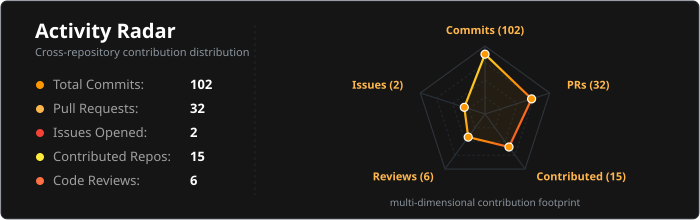

<!-- 🌅 LIGHT YELLOW-ORANGE-RED BANNER -->

 

---

### 🧠 About Me

- 🎓 **MS in Artificial Intelligence** at Brandenburg University of Technology (BTU Cottbus-Senftenberg)
- 🤖 **Agentic & Generative AI:** Engineering autonomous decision agents, multi-agent systems, and RAG pipelines
- 📊 **Energy & Market Data Analytics:** Engineering automated data pipelines and analytical dashboards for European electricity market intelligence
- 🔬 **Statistical Deep Learning:** Researching multi-modal sensor fusion (CoAtNets) and autoencoders for time-series anomaly detection

---

### ⚡ Activity & Streaks

<!-- 🔥 ORANGE & RED STREAK CARD -->

  

<!-- 🕸️ SPIDER WEB ACTIVITY RADAR CHART -->

  

<!-- 📈 TOTAL CONTRIBUTIONS & VELOCITY CURVE -->

---

### 🛠️ Tech Stack & Skills

  <b>Agentic AI & GenAI:</b> 
  
  
  
  
  

  <b>Data Analytics & Engineering:</b> 
  
  
  
  
  

  <b>Cloud, Backend & DevOps:</b> 
  
  
  
  
  

---

### 🚀 Highlighted Repositories & Work

| Project / System | Tech Focus | Key Deliverable | Link |
| :--- | :--- | :--- | :---: |
| **Agent Decision Router** | `Agentic AI` `Python` `Decision Logic` | Dynamic task-delegation and routing pipeline for automated LLM workflows. | [Repository](https://github.com/SrihithaJindam/agent-decision-router) |
| **RAG Knowledge Retrieval** | `RAG` `GenAI` `Vector Search` | Fast and accurate document retrieval pipeline built for specialized knowledge bases. | [Codebase](https://github.com/SrihithaJindam) |
| **XB Liquidity Analysis** | `Data Analytics` `Financial Modeling` | Statistical modeling and pipeline automation for liquidity & energy market metrics. | [Repository](https://github.com/SrihithaJindam50/XB_liquidity) |
| **Space Object Recognition** | `Multimodal Fusion` `CoAtNets` | Deep learning framework combining RGB and Depth data, achieving 92% classification accuracy. | [Publication](https://srihitha.graspins.com) |
| **Meteorological Anomaly Detection** | `Autoencoders` `k-NN` `Time-Series` | Early warning disaster detection for extreme weather patterns using deep autoencoders. | [Repository](https://github.com/SrihithaJindam) |

---

  ⚡ Consistency drives intelligence. Every commit counts towards building intelligent systems.

